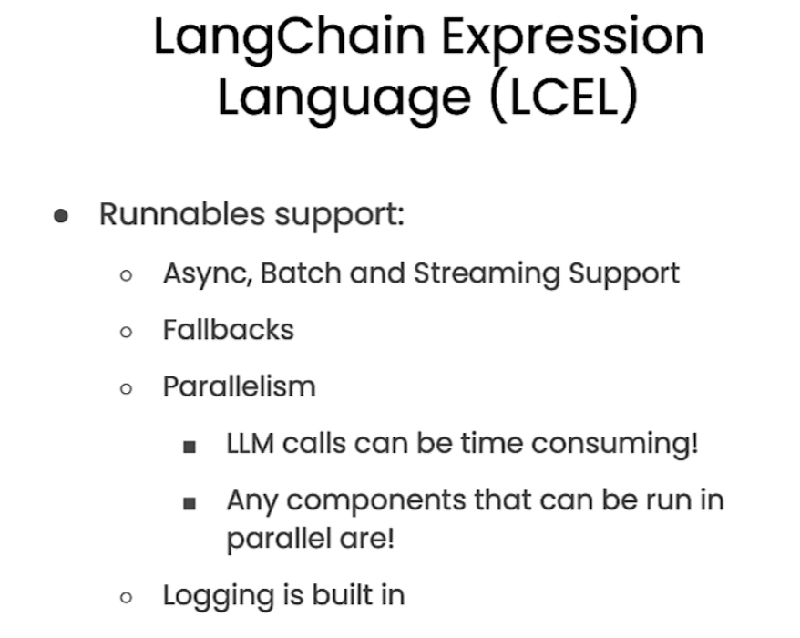

# [Functions, Tools and Agents with LangChain](https://www.deeplearning.ai/short-courses/functions-tools-agents-langchain/)

The landscape of LLMs and the libraries that support them has evolved rapidly in recent months. This course is designed to keep you ahead of these changes. 

You’ll explore new advancements like ChatGPT’s function calling capability, and build a conversational agent using a new syntax called LangChain Expression Language (LCEL) for tasks like tagging, extraction, tool selection, and routing.

After taking this course, you’ll know how to: 

- Generate structured output, including function calls, using LLMs;
- Use LCEL, which simplifies the customization of chains and agents, to build applications;
- Apply function calling to tasks like tagging and data extraction;
- Understand tool selection and routing using LangChain tools and LLM function calling – and much more.

Outline:
- OpenAI Function calling
- LangChain Expression Language (LCEL)
- OpenAI function calling in LangChain
- Tagging and Extraction using OpenAI function calling
- Tools and Routing
- Conversational Agent - Complex, multistep reasoning 

## LCEL Framework

1\ Anthropic - Effective AI Agents
2\ Menlo Ventures - Agent Architectures 
3\ Deloitte - Multi-Agents
4\ Microsoft - Agents Not Enough
5\ Uni Chicago - Vertical AI Agents
6\ AWS - Agent Best Practices
7\ Sequoia - GenAI Act o1
8\ McKinsey - Next Frontier
9\ Google - Agents
10\ WEF - Rise of AI Agents
